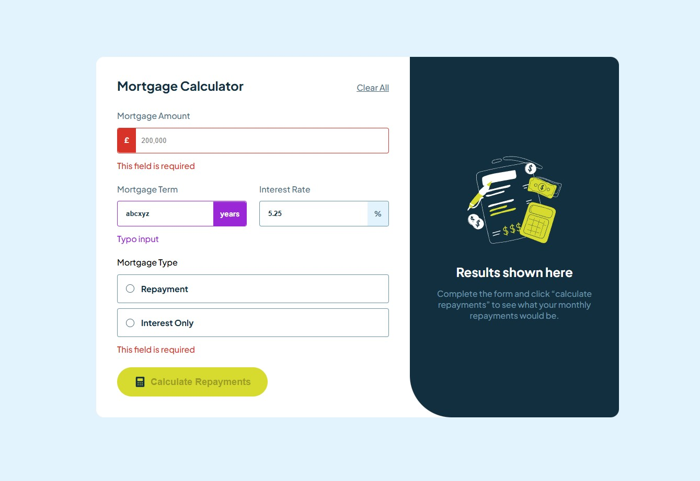

# Frontend Mentor - Mortgage repayment calculator solution

This is a solution to the [Mortgage repayment calculator challenge on Frontend Mentor](https://www.frontendmentor.io/challenges/mortgage-repayment-calculator-Galx1LXK73).

## Overview

This challenge focuses on implementing state management with form and also form validation in React along with interactive and responsive design. It's a great practice to sharpen React fundamentals and UI/UX thinking.

## Table of contents

  - [Feature](#feature)
  - [Screenshot](#screenshot)
  - [Links](#links)
- [My process](#my-process)
  - [Built with](#built-with)
  - [What I learned](#what-i-learned)
  - [Reflections & Future Improvements](#reflections--future-improvements)
  - [Useful resources](#useful-resources)
- [Author](#author)

---

### Feature

Users should be able to:

- Input mortgage information and see monthly repayment and total repayment amounts after submitting the form
- See form validation messages if any field is incomplete or typo
- Complete the form only using their keyboard
- View the optimal layout for the interface depending on their device's screen size
- See hover and focus states for all interactive elements on the page

### Screenshot

Below are screenshots illustrating the page preview:

    
     
    <em>Figure 1: Form completed (Desktop)</em>

 

    
     
    <em>Figure 2: Invalid or incomplete input</em>

 

    
     
    <em>Figure 3: Form completed (Mobile)</em>

 

The image above is just a sample preview.
You can explore the full experience on the DEMO below.

---

### Links

- Demo URL: [Link]()
- Solution URL: [Link]()

---

## My process

### Built with

- React (with Vite)
- HTML5 & CSS3
- JavaScript (ES6+)
- Mobile-first workflow

### What I learned

- This challenge helped me deeply understand form validation, including how different input types and input states affect the user experience through error messages and feedback.

- I gained insight into handling more complex logic structures within a form.

- I went a bit beyond the original requirements by implementing typo handling. Although it was a small addition, it taught me a lot about managing state. For example, I asked myself:
How should I display error messages for each individual field?
What if each field has a different type of invalid input—one is empty, while another has a typo?
This made me consider how to structure and manage state in a more flexible and scalable way.

### Reflections & Future Improvements

- I'm feeling more comfortable with state management, but as the number of state variables grows, I still occasionally struggle with how to structure the logic cleanly. I plan to keep practicing this to improve my fluency and confidence.

- I noticed that my CSS is starting to feel messy. As a next step, I'd like to explore a CSS framework like Tailwind CSS to help keep my styles more organized and maintainable.

### Useful resources

- [freeCodeCamp - Front End Libraries](https://www.freecodecamp.org/learn/full-stack-developer/) - This interactive course helped me learn the foundational concepts of React through short lessons and hands-on challenges. The built-in code validation system gives instant feedback, which is really helpful for beginners.
> 💡 **Tip:** The auto-checking system on freeCodeCamp can be very strict. If you're confident your code is correct but it's not passing, consider using tools like ChatGPT to double-check or help debug your solution!

---

## Author

- Frontend Mentor - [@pete13232](https://www.frontendmentor.io/profile/pete13232)
